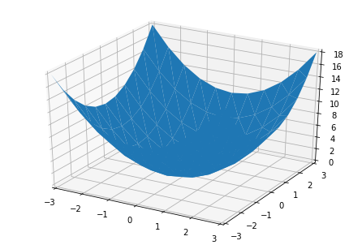

```python
from stl_utils import grid2vec,show_vec,vec2mesh
import numpy as np
from stl import mesh
```


```python
size = 11
_x = np.linspace(-3,3,size)
_y = np.linspace(-3,3,size)
x,y = np.meshgrid(_x,_y)
z = x**2+y**2
```


```python
grids = np.stack([x,y,z],axis=2)
```


```python
vec = grid2vec(grids)
```


```python
ax=show_vec(vec)

```





```python
m = vec2mesh(vec)
m
```


    <stl.mesh.Mesh at 0x125b7ae4160>


```python
m.save('sample.stl')
```
